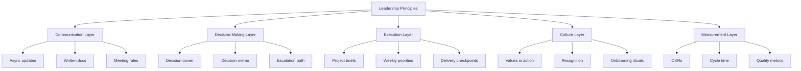

---
title: Building Remote-First Teams
repo: founder-operating-system
primary_keyword: Leadership
secondary_keywords:
- Startup
- Culture
- Business Operations
slug: building-remote-first-teams
word_count_target: 1200
commit_type: 'docs(founder):'---

# Building Remote-First Teams with Strong Leadership

## Introduction

Remote-first teams are no longer a temporary workaround; for many companies, they are the operating model. For founders and executives, the real challenge is not whether people can work remotely, but whether **Leadership** can create clarity, accountability, and trust without physical proximity.

A remote-first **Startup** can move quickly if its systems are designed for distributed execution. That requires intentional **Culture**, disciplined **Business Operations**, and a management style that treats communication as infrastructure. When these elements are weak, remote work amplifies confusion. When they are strong, remote teams often outperform co-located ones on speed, access to talent, and retention.

This article explains how to build remote-first teams with practical structures, measurable workflows, and leadership habits that scale.

## Problem Statement

Many companies say they are remote-friendly but still operate like an office-centric organization. Meetings happen in one time zone, decisions are made in side conversations, and critical context lives in private chats. The result is predictable: duplicated work, slower execution, and employees who feel excluded from decision-making.

Remote-first failures usually come from four gaps:

1. **Unclear decision rights**  
   If no one knows who owns a decision, work stalls or gets re-litigated.

2. **Inconsistent communication**  
   Teams rely on synchronous meetings for problems that should be solved asynchronously.

3. **Weak onboarding and documentation**  
   New hires spend weeks reconstructing context that should have been written down.

4. **Culture by proximity**  
   Employees who are physically closer to founders get more information, more trust, and more opportunities.

For founders, the issue is not just productivity. It is organizational design. Remote-first teams need systems that make work visible, decisions durable, and performance measurable.

## Solution

The solution is to design for remote execution from the start, rather than adapting office habits to distributed work. Strong **Leadership** in a remote-first environment means building three things:

- **Clear operating rules**
- **Reliable communication channels**
- **A culture of written accountability**

Start with a few core principles:

### 1. Default to asynchronous communication
Use written updates, project docs, and recorded decisions as the primary coordination layer. Meetings should be reserved for ambiguity, conflict resolution, and high-bandwidth collaboration.

### 2. Define ownership explicitly
Every project should have a single accountable owner, a deadline, success criteria, and a review cadence. Shared responsibility without clear ownership often becomes no responsibility.

### 3. Standardize documentation
Create templates for project briefs, decision memos, onboarding plans, and weekly updates. Documentation should answer: what is being done, why it matters, who owns it, and what “done” means.

### 4. Build trust through visibility
Use dashboards, written status reports, and outcome-based metrics. Remote teams trust what they can see, not what they hear informally.

### 5. Manage by outcomes, not presence
Measure output, quality, and timeliness. Avoid proxy metrics like online status or response speed unless they are tied to a real operational need.

A remote-first **Startup** succeeds when leadership treats clarity as a product: it must be designed, maintained, and improved continuously.

## Architecture or Framework

A practical framework for remote-first teams is the **Remote Operating System (ROS)**. It has five layers: communication, decision-making, execution, culture, and measurement.

### Layer 1: Communication
Set rules for when to write, when to meet, and where context lives. For example:
- Slack for quick coordination
- Notion or Confluence for durable documentation
- Loom or recorded demos for walkthroughs
- Weekly written updates from each function

### Layer 2: Decision-Making
Use a simple decision memo format:
- Problem
- Options considered
- Recommendation
- Owner
- Deadline
- Risks

This reduces repeated debates and makes decisions auditable.

### Layer 3: Execution
Break work into measurable deliverables. Each team should use:
- Weekly priorities
- Owner assignment
- Delivery dates
- Blocker escalation rules

This is especially important for **Business Operations**, where cross-functional work can easily become invisible.

### Layer 4: Culture
Remote culture is built through repeated behaviors, not slogans. Founders should define how the company communicates, resolves conflict, gives feedback, and celebrates wins. Culture should be observable in onboarding, performance reviews, and leadership meetings.

### Layer 5: Measurement
Track a small set of metrics:
- Project cycle time
- On-time delivery rate
- Employee engagement
- Attrition by team
- Decision turnaround time
- Documentation coverage

These metrics show whether remote work is helping or hurting execution.

## Benefits

Remote-first teams offer meaningful advantages when leadership is disciplined.

### Better talent access
You can hire from a wider geography and recruit people based on skill, not location. This is especially valuable for specialized roles in engineering, design, finance, and operations.

### Lower coordination overhead over time
Although remote work requires more written structure initially, it can reduce unnecessary meetings and interruptions. Teams spend less time on ad hoc updates and more time on actual work.

### Stronger documentation
Remote-first systems naturally produce better records. That improves continuity when people leave, when teams scale, or when new priorities emerge.

### More resilient operations
If a company can function well across time zones and without a central office, it becomes less dependent on any single location or routine.

### Higher accountability
When everyone works from clear goals and written commitments, performance becomes easier to evaluate. This helps **Leadership** make better promotion, hiring, and restructuring decisions.

## Challenges

Remote-first teams also create specific risks that founders must address early.

### Isolation and weak belonging
Employees may feel disconnected if they only interact through tasks. Leaders need intentional rituals: onboarding buddy systems, regular 1:1s, team retrospectives, and periodic in-person gatherings when possible.

### Communication overload
Written communication can become noisy if everything is treated as urgent. Establish rules for response times, message channels, and meeting thresholds. Not every update needs a meeting.

### Uneven manager quality
Remote management requires stronger coaching skills than office management. Managers must be able to set expectations, review work asynchronously, and give precise feedback in writing.

### Hidden performance issues
Low performers can be harder to spot when managers rely on visibility instead of output. This is why outcome metrics and regular review cycles matter.

### Time zone complexity
Distributed teams can slow down if handoffs are poorly designed. Use overlap windows for critical collaboration and document dependencies clearly.

The main trade-off is simple: remote-first teams require more structure. Without that structure, **Culture** becomes fragmented and execution becomes inconsistent.

## Future Opportunities

Remote-first work is evolving from a location policy into a competitive operating model. Founders who invest in remote systems now will be better positioned to scale.

### AI-assisted operations
AI tools can summarize meetings, draft project updates, surface blockers, and improve documentation quality. This can reduce coordination costs if used carefully and reviewed by humans.

### Global team design
Companies will increasingly build teams across regions with intentional coverage for support, engineering, sales, and operations. That requires better handoff design and clearer role definitions.

### More sophisticated management tooling
Expect stronger platforms for async collaboration, decision tracking, and performance analytics. These tools will make remote leadership more measurable.

### Culture as a strategic asset
As remote work becomes common, companies that build a distinctive, healthy culture will attract and retain better talent. Culture will matter less as a poster and more as a system of behaviors.

For founders, the opportunity is to build a remote-first organization that is not merely distributed, but operationally excellent.

## Conclusion

Remote-first teams succeed when **Leadership** creates clarity, trust, and accountability through systems rather than proximity. The best remote organizations do not depend on constant meetings or informal hallway conversations. They rely on written decisions, explicit ownership, and measurable execution.

For any **Startup** aiming to scale, remote-first can be a durable advantage if supported by strong **Business Operations** and a deliberate **Culture**. The founders who win in this model will be the ones who treat communication, documentation, and management as core infrastructure.

If you want remote work to improve performance instead of fragmenting it, build the operating system before you scale the headcount.

## Related Reading

- (pending)