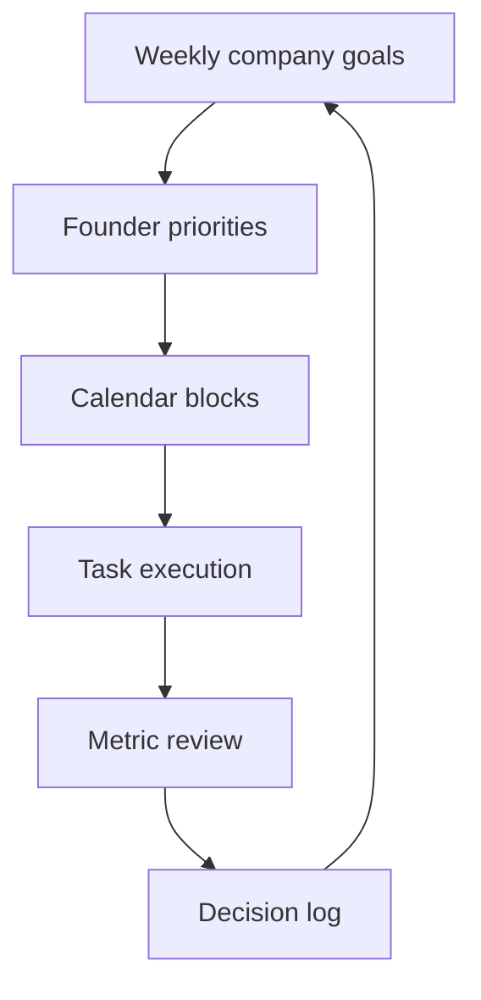

---
title: Founder Productivity Systems
repo: founder-operating-system
primary_keyword: Founder
secondary_keywords:
- CEO
- Business Operations
- Growth Strategy
slug: founder-productivity-systems
word_count_target: 1200
commit_type: 'docs(founder):'---

# Founder Productivity Systems

## Introduction

A strong **Founder** productivity system is not about packing more tasks into a day. It is about designing a repeatable operating model that protects attention, improves decision quality, and keeps the company moving without constant founder intervention. For early-stage startups, the founder is often the bottleneck for strategy, hiring, sales, and execution. Without a system, the calendar becomes reactive, priorities drift, and important work gets replaced by urgent work.

The best founder productivity systems combine personal habits with company-level **Business Operations**. They create a structure for planning, communication, and review so the **CEO** can spend more time on high-value decisions and less time context switching. When done well, this also supports **Growth Strategy** by making execution measurable and predictable.

## Problem Statement

Most founders do not fail because they lack ambition. They fail because their operating cadence is inconsistent.

Common failure modes include:

- No clear weekly priorities, so every issue feels equally important
- Too many tools and no source of truth
- Reactive scheduling that leaves no time for deep work
- Decision fatigue caused by constant Slack, email, and meeting interruptions
- Poor delegation, which keeps the founder in operational details
- No metrics review process, so the team cannot see progress or risk early

These issues compound quickly. A founder who spends 60% of the week in low-value meetings loses strategic control. A startup without a reliable productivity system may still ship features, but it will struggle to build momentum in hiring, customer retention, and fundraising preparation.

The core problem is not time management alone. It is the absence of an operating system for the founder role.

## Solution

A practical founder productivity system should run on four layers:

1. **Prioritization**
2. **Time allocation**
3. **Execution tracking**
4. **Review and adjustment**

### 1. Prioritization

Use a simple rule: limit active priorities to three company outcomes per week. These should map to the business stage, such as:
- improve activation
- close pipeline deals
- hire a key engineer

Each priority should have one owner, one metric, and one deadline. This prevents vague tasks from consuming the week.

### 2. Time allocation

Block the calendar by work type rather than by convenience:
- deep work blocks for strategy, writing, or analysis
- meeting blocks for team syncs and external calls
- admin blocks for email, approvals, and finance

A **Founder** should protect at least two uninterrupted deep work sessions per week. If the calendar is fully open, others will fill it.

### 3. Execution tracking

Use a single weekly tracker with:
- top priorities
- key decisions needed
- delegated tasks
- risks and blockers
- metrics snapshot

This can live in Notion, Linear, Asana, or a spreadsheet. The tool matters less than the discipline of updating it every week.

### 4. Review and adjustment

A founder productivity system should include:
- daily 10-minute planning
- weekly review
- monthly strategy reset

The weekly review checks what moved, what stalled, and what should be cut. The monthly reset connects execution to **Growth Strategy** and ensures the team is not optimizing the wrong problem.

## Architecture or Framework

A useful framework is the **Founder OS Loop**: Plan → Protect → Execute → Review.

### Plan

Start each week by defining:
- 3 company priorities
- 3 founder priorities
- 1 metric per priority

Example:
- Increase demo-to-close rate from 18% to 25%
- Hire one senior product engineer
- Reduce support response time below 4 hours

### Protect

Protect attention with explicit rules:
- no meeting days or half-days
- Slack check windows twice per day
- email triage only at fixed times
- delegate routine approvals

This is where many **CEO**s fail. They create priorities but do not defend the time required to execute them.

### Execute

Work from a decision log and task queue. A decision log records:
- decision needed
- context
- options
- chosen path
- owner
- date

This reduces repeated discussions and helps new leaders understand why choices were made. For **Business Operations**, this becomes especially valuable as the company scales and more people need access to the reasoning behind decisions.

### Review

Use a simple scorecard:
- Did the week’s top 3 priorities move?
- Which meetings were unnecessary?
- What should be delegated next week?
- Which metric improved, worsened, or stayed flat?

If a task appears for three consecutive weeks, it is either blocked, under-resourced, or not important enough.

## Benefits

A founder productivity system creates measurable advantages.

### Better focus

By limiting active priorities, the founder avoids spreading attention across too many initiatives. Focus improves the quality of execution and reduces mental fatigue.

### Faster decision-making

A decision log and weekly review cycle reduce indecision. The founder can make smaller decisions faster and reserve energy for the few that matter.

### Stronger delegation

When routine work is tracked and standardized, it is easier to assign to an operator, chief of staff, or functional lead. This improves team ownership and frees the **Founder** from becoming the default executor.

### Improved operating rhythm

A clear system creates consistency across **Business Operations**. Team members know when priorities are set, when metrics are reviewed, and how escalations should happen.

### Better growth alignment

A founder productivity system keeps daily work tied to **Growth Strategy**. Instead of chasing noise, the team can connect time spent to outcomes like revenue, retention, hiring speed, or product activation.

## Challenges

Even a strong system has trade-offs.

### Over-structuring early-stage work

A startup changes quickly. If the system is too rigid, it can slow response time. Founders should keep the framework lightweight and revise it as the company matures.

### Tool overload

Many founders adopt new software instead of better habits. More tools usually create more fragmentation. One source of truth is enough for most teams.

### Delegation gaps

A productivity system only works if the founder actually delegates. If every task still routes back to the **CEO**, the system becomes a fancy to-do list.

### Inconsistent review discipline

The weekly review is the most important part of the system, but it is also the easiest to skip. Without review, the system loses feedback loops and becomes stale.

### False productivity

A full calendar can look productive while hiding low-impact work. The right metric is not hours worked. It is whether the founder moved the company’s highest-value outcomes.

## Future Opportunities

Founder productivity systems will become more data-driven and more automated.

### AI-assisted planning

AI tools can summarize meetings, extract action items, and draft weekly priority plans. This reduces admin load, but the founder still needs to make judgment calls about what matters.

### Better operational dashboards

More startups will connect calendars, task tools, and revenue metrics into a single view. That will make it easier to see how founder time maps to business outcomes.

### Delegation analytics

Future systems may track which tasks recur, how long they take, and who should own them. This can help founders identify delegation opportunities earlier.

### Founder role specialization

As startups mature, the founder’s role shifts from execution to leadership, capital allocation, and strategy. Productivity systems will need to evolve with that shift, especially for founders who transition into a more formal **CEO** role.

## Conclusion

A founder productivity system is a business asset, not a personal preference. It gives the **Founder** a repeatable way to prioritize, protect time, execute work, and review outcomes. It also strengthens **Business Operations** by creating a predictable rhythm for decisions and accountability.

The best systems are simple, visible, and reviewed weekly. They do not try to eliminate chaos from startup life. They make chaos manageable so the team can keep moving toward the right **Growth Strategy**.

Start with three priorities, protected calendar blocks, a single execution tracker, and a weekly review. That is enough to build momentum without overengineering the process.

## Related Reading

- (pending)