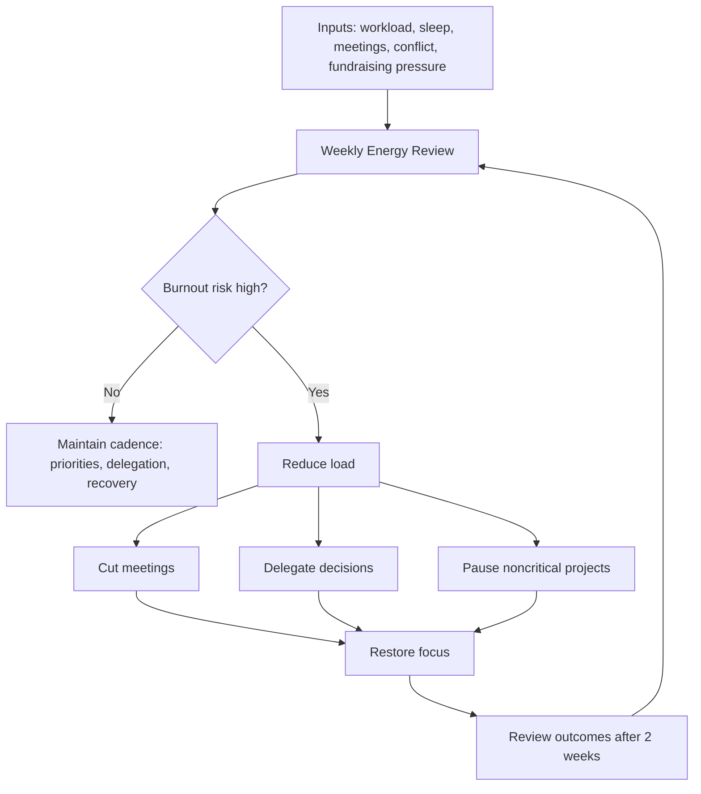

---
title: Managing Founder Burnout
repo: founder-operating-system
primary_keyword: Founder
secondary_keywords:
- Leadership
- CEO
- Business Operations
slug: managing-founder-burnout
word_count_target: 1200
commit_type: 'docs(founder):'---

# Managing Founder Burnout

## Introduction

Founder burnout is not a personal weakness; it is an operational risk that can slow decision-making, damage team morale, and reduce the quality of strategic judgment. For many startups, the Founder is the bottleneck for product direction, hiring, fundraising, and culture. When that person becomes depleted, the entire company feels it.

This article is for founders and startup leaders who need a practical system for recognizing burnout early, reducing load without losing momentum, and building a company that does not depend on constant personal exhaustion. The goal is not to work less for its own sake. The goal is to protect long-term performance, clarity, and resilience.

## Problem Statement

Founder burnout often starts quietly. The Founder keeps pushing through fatigue, assumes stress is normal, and treats recovery as a reward rather than a requirement. Over time, the symptoms become visible:

- Decision latency increases.
- Small problems feel disproportionately large.
- The Founder becomes reactive instead of strategic.
- Sleep, exercise, and focus degrade.
- Team communication becomes shorter, sharper, or less frequent.

For a CEO, this creates a compounding business issue. A tired leader makes lower-quality calls on hiring, capital allocation, and Business Operations. Burnout can also create hidden costs: missed follow-ups with investors, delayed product reviews, unresolved team conflict, and inconsistent Leadership.

The core problem is structural. Many startups are built around heroic effort, unclear boundaries, and constant urgency. That model works briefly, then breaks. If the company’s operating system assumes the Founder can absorb endless pressure, burnout is not an exception; it is the expected outcome.

## Solution

Managing Founder burnout requires treating energy like a company resource. The solution is a system with four parts:

1. **Detect pressure early**
2. **Reduce cognitive load**
3. **Delegate operational ownership**
4. **Create recovery as a routine**

### 1. Detect pressure early

Do not wait for a crisis. Track a simple weekly scorecard:

- Sleep quality
- Energy on waking
- Number of high-stakes decisions made
- Hours spent in deep work
- Time spent in meetings
- Emotional reactivity
- Exercise and recovery

If two or more indicators decline for two consecutive weeks, treat it as an intervention point. This makes burnout measurable instead of subjective.

### 2. Reduce cognitive load

Founders often carry too many open loops. Use a written operating cadence:

- Weekly priorities: no more than 3
- Daily top task: 1 critical outcome
- Decision log: record major decisions and why they were made
- Meeting filters: cancel or shorten recurring meetings that do not drive decisions

The aim is to protect attention. A Founder does not need more discipline alone; they need fewer competing inputs.

### 3. Delegate operational ownership

Burnout worsens when the Founder remains the default owner of every issue. Shift recurring work into clear ownership areas:

- Hiring pipeline management
- Finance and reporting
- Customer support escalation
- Internal project tracking
- Calendar and meeting prep

If the CEO is still approving every operational detail, the company has not delegated; it has only redistributed stress. Define decision rights and escalation rules so the Founder only gets involved when a threshold is met.

### 4. Create recovery as a routine

Recovery should be scheduled, not aspirational. Protect:

- Sleep window
- Exercise blocks
- No-meeting time
- Weekly reflection
- At least one half-day with no strategic work

These are not perks. They are part of sustainable Leadership. A Founder who never recovers eventually becomes less effective, even if they remain busy.

## Architecture or Framework

A practical framework for managing Founder burnout is the **Founder Energy Operating System (FEOS)**. It aligns personal energy, company priorities, and Business Operations.

### FEOS components

**1. Inputs**
Track the main sources of strain:
- Meeting volume
- Fundraising activity
- Team conflict
- Product incidents
- Personal sleep and exercise

**2. Weekly Energy Review**
Every week, answer:
- What drained me most?
- What decisions can be delegated?
- What work created value versus noise?
- What can be paused for 14 days?

**3. Load reduction**
Use a temporary reduction plan when needed:
- Remove 20–30% of meetings
- Delay noncritical initiatives
- Move one recurring decision to another leader
- Replace live discussions with written updates

**4. Recovery loop**
After two weeks, evaluate:
- Are sleep and focus improving?
- Is decision speed returning?
- Is the team functioning without constant Founder input?

If not, the issue may be deeper than workload and may require structural changes in team design or personal support.

This framework works because it turns burnout management into an operating process, not a morale discussion.

## Benefits

A structured approach to Founder burnout produces measurable business gains.

### Better decision quality
When the Founder is rested, judgment improves. This matters in hiring, pricing, fundraising, and product strategy. A clear CEO makes fewer emotional decisions and more consistent trade-offs.

### Stronger team autonomy
Delegation forces clarity. When ownership is explicit, managers stop waiting for the Founder to resolve every issue. That improves speed and accountability across the company.

### More stable culture
Burnout often spreads. If the Founder is exhausted, the team may copy that behavior, normalize urgency, and avoid healthy boundaries. Sustainable Leadership sets a healthier standard.

### Improved Business Operations
A calmer Founder is better at reviewing metrics, spotting process gaps, and maintaining operational discipline. That leads to cleaner execution and fewer preventable mistakes.

### Better fundraising presence
Investors notice founder energy. Not enthusiasm alone, but consistency, focus, and the ability to answer hard questions without visible depletion. A stable Founder communicates confidence more effectively than one running on fumes.

## Challenges

Managing burnout is simple in theory and difficult in practice.

### 1. Founder identity is tied to overwork
Many founders believe exhaustion proves commitment. That mindset makes rest feel like weakness. The fix is reframing recovery as a performance requirement, not a luxury.

### 2. Delegation creates discomfort
Letting go of work can feel risky, especially in early-stage companies. But if everything depends on the Founder, the company is fragile. Start with low-risk delegation and expand from there.

### 3. Urgency keeps returning
Startups generate real pressure: churn, cash constraints, hiring gaps, and product deadlines. The answer is not to eliminate urgency, but to build buffers and rules so urgency does not consume every week.

### 4. Burnout is sometimes mixed with deeper issues
Not all fatigue is caused by workload. Sometimes the real issue is misalignment, loneliness, unresolved conflict, or lack of confidence in the company’s direction. In those cases, the solution may include coaching, peer support, or a leadership reset.

### 5. Metrics can be ignored
Founders may track revenue more carefully than their own energy. Put burnout indicators into the same weekly review as Business Operations metrics. What gets reviewed gets managed.

## Future Opportunities

The next generation of founder support will likely be more systematic.

### Founder health dashboards
Startups may adopt lightweight dashboards that combine business metrics with energy metrics, such as meeting load, sleep consistency, and decision backlog. This can help CEOs spot strain before it becomes a crisis.

### Better leadership operating models
Companies are moving away from founder-centric control toward distributed Leadership. That means clearer ownership, stronger managers, and fewer decisions trapped at the top.

### AI-assisted Business Operations
AI tools can reduce administrative load by summarizing meetings, drafting updates, and surfacing action items. Used well, this can remove repetitive work from the Founder’s plate and preserve attention for strategy.

### More honest founder culture
The startup ecosystem is slowly becoming more open about burnout, therapy, coaching, and recovery. That cultural shift can help new founders build healthier companies from the start rather than fixing damage later.

## Conclusion

Founder burnout is not solved by motivation alone. It requires a deliberate operating system that protects attention, clarifies ownership, and normalizes recovery. For any CEO, the healthiest version of Leadership is not constant intensity; it is sustained effectiveness.

If you are the Founder, treat your energy as a core company asset. Measure it, manage it, and build structures that reduce unnecessary strain. The result is not only a healthier person, but a stronger company.

## Related Reading

- (pending)