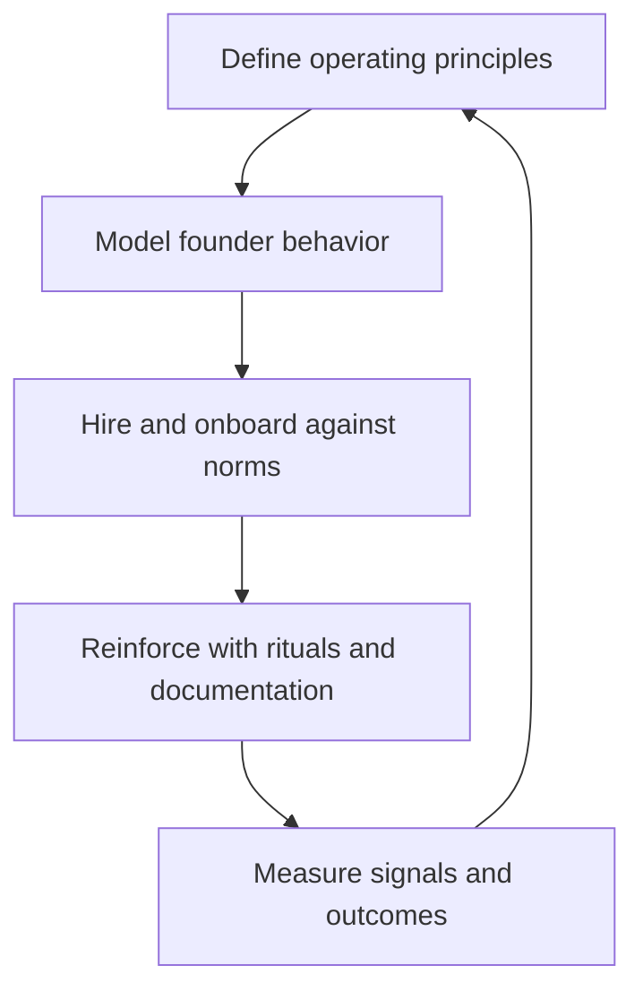

---
title: Startup Culture on Day One
repo: founder-operating-system
primary_keyword: Culture
secondary_keywords:
- Leadership
- Startup
- Founder
slug: startup-culture-on-day-one
word_count_target: 1200
commit_type: 'docs(founder):'---

# Startup Culture on Day One

## Introduction

**Culture** is not a poster on the wall or a perks package. For an early-stage **Startup**, culture is the repeated behavior that becomes the default when the founder is not in the room. On day one, every decision—how you hire, how you write, how you disagree, how you ship—starts defining what your company will tolerate, reward, and eventually become.

For founders, this matters because early **Leadership** habits scale faster than product code. A startup can change its roadmap in a week, but it can take years to undo a weak culture of ambiguity, avoidance, or heroics. The first team members will not just execute the company vision; they will interpret it, amplify it, and pass it on.

This article explains how to build startup culture on day one with practical systems, founder behaviors, and measurable guardrails.

## Problem Statement

Many founders treat culture as something to formalize later, after product-market fit or after the first hiring wave. That creates three common problems:

1. **Implicit norms become the culture**
   If the founder answers emails at midnight, celebrates burnout, or changes priorities without explanation, the team learns that chaos is normal. The company may still move quickly, but it will do so with confusion and inconsistent standards.

2. **Hiring happens before values are clear**
   Early hires shape the company more than almost any other decision. If the founder cannot articulate what good looks like, hiring defaults to “smart and available.” That often produces a team that is talented but misaligned on ownership, communication, and decision-making.

3. **Execution and culture get separated**
   Some founders think culture is “soft” and execution is “hard.” In reality, execution quality is a direct output of **Leadership**, clarity, and trust. A team that does not know how decisions are made will spend time guessing instead of building.

The result is a fragile **Startup** environment where speed is high in the short term but coordination costs rise quickly. Teams waste time re-litigating decisions, and the founder becomes the bottleneck for everything.

## Solution

Build culture intentionally from day one by defining a small set of operating principles and reinforcing them through daily behavior.

### 1. Write the culture you want in operational terms

Avoid vague statements like “we value excellence” or “we move fast.” Translate values into observable behavior.

Examples:
- “We disagree in the open and commit in private.”
- “We document decisions before implementation.”
- “We raise risks early, even when the news is uncomfortable.”
- “We do not confuse urgency with priority.”

These statements are useful because they can be evaluated. A candidate, manager, or founder can ask: did we actually do this?

### 2. Model the behavior before asking others to adopt it

The founder is the first culture system. If you want ownership, show ownership. If you want transparency, explain trade-offs and context. If you want calm execution, do not create artificial emergencies.

In practice:
- Share weekly priorities and why they matter.
- Admit mistakes quickly.
- Explain what changed when you change direction.
- Avoid rewarding last-minute firefighting as if it were excellence.

This is where **Founder** behavior matters most. The team will copy what you repeatedly do, not what you occasionally say.

### 3. Hire for cultural fit and cultural add

Cultural fit should not mean “people like me.” It should mean alignment with how the company works. Cultural add means the person strengthens the team with a different perspective while respecting the operating norms.

Use interview questions such as:
- Tell me about a time you disagreed with leadership. What did you do?
- How do you communicate bad news?
- What does strong ownership look like to you?
- When have you had to work with unclear priorities?

Score answers against your operating principles, not charisma.

### 4. Create lightweight rituals that reinforce norms

Culture is reinforced through repetition. Early rituals should be simple and high-signal:
- Weekly team priorities review
- Decision log for important choices
- Postmortems without blame
- Demo days for shipping progress
- 1:1s focused on blockers, not status theater

These rituals help a small **Startup** behave like a coherent organization without adding bureaucracy.

### 5. Document the minimum viable culture

A one-page culture memo is often enough at the beginning. Include:
- Mission
- Operating principles
- Decision-making rules
- Communication norms
- Hiring standards
- What the company will not tolerate

Keep it short enough to be read, discussed, and revised. Culture should be a living document, not a manifesto nobody references.

## Architecture or Framework

A practical framework for startup culture on day one is the **Culture Operating System**: define, model, reinforce, and measure.

### Step 1: Define

Choose 3 to 5 principles only. More than that becomes noise. Good principles are:
- Memorable
- Observable
- Relevant to the business model
- Hard to misinterpret

Example for an early SaaS team:
- Customer problems first
- Clear writing before meetings
- Fast decisions, reversible when possible
- Disagree openly, commit fully
- High ownership, low ego

### Step 2: Model

The founder must make the principles visible in daily work:
- Send written context before meetings
- Make decisions with explicit reasoning
- Show how trade-offs are evaluated
- Avoid favoritism in praise and access

If the founder ignores the principles under pressure, the team will assume they are optional.

### Step 3: Reinforce

Use hiring, onboarding, and performance check-ins to reinforce the same behaviors:
- Onboarding: explain how decisions are made, where information lives, and how escalation works
- Hiring: assess communication, ownership, and judgment
- Performance: review outcomes and behaviors together

This is where **Leadership** becomes a system, not a personality trait.

### Step 4: Measure

Track early indicators of cultural health:
- Time to decision on key issues
- Number of repeated clarifications needed per project
- % of work documented before build starts
- Employee pulse score on clarity and trust
- Attrition among first 10 hires
- Postmortem completion rate after incidents

These metrics are not perfect, but they help founders detect drift before it becomes expensive.

## Benefits

When culture is built intentionally from day one, the company gains several advantages.

### Faster execution with less coordination overhead
Teams spend less time guessing what matters. Clear norms reduce meetings, rework, and escalation noise.

### Better hiring quality
Candidates self-select more accurately when they understand how the company operates. That improves both acceptance rates and retention.

### Stronger trust
When the founder is consistent, people trust that decisions are made with a process rather than mood. That trust improves speed and reduces politics.

### Easier scaling
A well-defined **Culture** gives new hires a reference point. Instead of reinventing norms every quarter, the company can onboard people into an existing system.

### Higher resilience
During product failures, fundraising stress, or market shifts, teams with strong culture are less likely to fragment. They know how to communicate under pressure and how to recover without blame.

## Challenges

Building culture early is useful, but it is not easy.

### Over-engineering too soon
Some founders create a heavy set of values, policies, and rituals before the company has learned enough. That can slow down experimentation. Keep the system small and revise it as the company changes.

### Confusing culture with comfort
A healthy culture is not always comfortable. It should support candor, accountability, and high standards. If everyone is always comfortable, important issues may be getting avoided.

### Founder inconsistency
The most common failure mode is inconsistency. A founder may praise one behavior in the morning and reward the opposite by evening. That creates cynicism fast.

### Hiring for sameness
If the team only hires people who think alike, the company may look aligned but become brittle. The goal is shared principles, not identical personalities.

### Scaling culture faster than management
As the team grows, the founder cannot personally reinforce every norm. Without managers who understand the operating system, culture can drift. This is why early documentation and manager training matter.

## Future Opportunities

As the company grows, culture can evolve from founder-led to system-led without losing its core.

### AI-assisted knowledge systems
Founders can use AI tools to index decision logs, culture docs, and onboarding materials so new hires can find context quickly. This reduces repeated explanations and improves consistency.

### More data-driven culture management
Employee surveys, retention data, and collaboration patterns can reveal early signs of confusion or burnout. The best teams will treat culture as something measurable, not mystical.

### Distributed and remote-first norms
Remote teams require stronger written communication and clearer decision records. That creates an opportunity to design culture around clarity rather than proximity.

### Manager development
As the company scales, first-time managers become the main carriers of culture. Investing in manager training early can prevent drift and preserve the company’s operating principles.

### Culture as a strategic asset
For mature startups, culture can become a competitive advantage in hiring, customer trust, and execution quality. Companies that are known for clarity and accountability tend to attract stronger talent and move with less internal friction.

## Conclusion

**Culture** on day one is not about slogans. It is about building a repeatable operating system for how a **Startup** behaves under pressure, makes decisions, and treats people. Founders shape this system through daily **Leadership** choices, especially in hiring, communication, and accountability.

If you want a durable company, start with a small set of principles, model them visibly, reinforce them through rituals, and measure whether they are actually working. The earlier you do this, the less you will need to correct later.

For founders, the key lesson is simple: culture is not what you write down once. It is what your team experiences every day.

## Related Reading

- (pending)