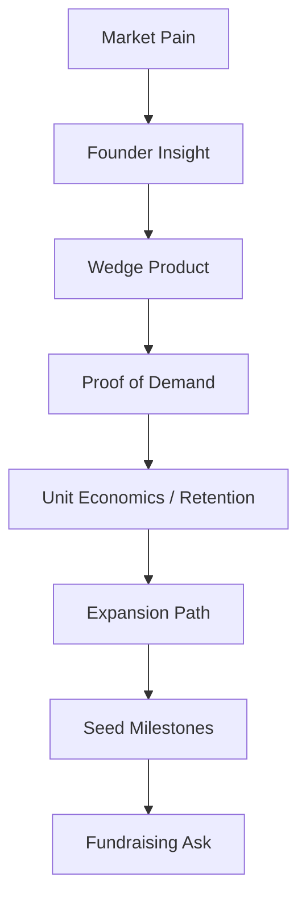

---
title: Fundraising Narrative for Seed Rounds
repo: founder-operating-system
primary_keyword: Fundraising
secondary_keywords:
- Startup
- CEO
- Growth Strategy
slug: fundraising-narrative-for-seed-rounds
word_count_target: 1200
commit_type: 'docs(founder):'---

# Fundraising Narrative for Seed Rounds

## Introduction

Fundraising is not just about asking for money. For a seed-stage startup, it is the process of turning an early company into a believable future outcome. Investors are not only evaluating the product; they are evaluating whether the founder can explain why this startup can become a meaningful business, why now is the right time, and why this team can execute.

A strong fundraising narrative helps a CEO answer three questions quickly:

1. Why does this problem matter?
2. Why is this company the right solution?
3. Why will this team win?

At seed round stage, narrative often matters as much as traction. Early revenue, user growth, or pilots help, but they need context. The best founders connect market pain, product insight, and a credible Growth Strategy into one clear story. Without that, even good metrics can feel disconnected.

## Problem Statement

Most seed fundraising decks fail for one of four reasons.

First, the story is too feature-focused. Founders describe the product in detail but never explain the market opportunity. Investors leave knowing what the software does, but not why it should exist as a venture-scale company.

Second, the narrative is too broad. A Startup tries to solve many problems for many customers. That makes the company sound ambitious, but it usually weakens conviction. Seed investors want focus: a specific wedge, a clear buyer, and a path to expansion.

Third, the story lacks proof. A CEO may claim strong demand, but if the deck does not show qualified pipeline, retention, or repeatable customer behavior, the claim is hard to believe.

Fourth, the narrative is not aligned with the round. A seed round is about proving the first repeatable motion, not proving everything. Many founders overbuild the pitch with long-term vision but under-explain the near-term milestones that the financing will unlock.

The result is predictable: investors ask for more data, more clarity, or a better story. That is not a presentation problem; it is a narrative architecture problem.

## Solution

The solution is to build a fundraising narrative around a simple structure:

- Problem
- Insight
- Solution
- Traction
- Market
- Why now
- Team
- Use of funds
- Milestones

This structure works because it mirrors how investors make decisions. They want to understand the pain, believe the founder has unique insight, see evidence that the market cares, and know what progress the seed round will buy.

A practical way to craft the narrative:

1. Start with a painful, specific problem.  
   Use a real workflow, buyer persona, or operational cost. Avoid abstract language. “Teams waste time on admin” is weak. “Revenue teams spend 12 hours per week reconciling CRM updates across five tools” is stronger.

2. Explain the founder insight.  
   Why did you see the problem earlier than others? This is where the CEO establishes credibility. The insight can come from prior domain experience, direct customer work, or a technical breakthrough.

3. Show the wedge solution.  
   Seed investors do not need the full platform vision first. They need to understand the initial product that gets adoption. Make the first use case concrete.

4. Tie traction to behavior, not vanity.  
   Revenue, retention, activation, and expansion are more persuasive than downloads or impressions. If the Startup is pre-revenue, show pilots, waitlist conversion, or strong usage patterns.

5. Define the market expansion path.  
   A good Growth Strategy explains how the initial wedge expands into adjacent use cases, larger accounts, or deeper workflows.

6. State the financing purpose.  
   Investors want to know what progress the round enables: hiring, product completion, distribution tests, or a specific milestone like $1M ARR or 20 design partners.

The narrative should feel inevitable, not optimistic. The best seed stories make the company seem like the obvious answer to a clear market gap.

## Architecture or Framework

A useful framework for seed fundraising is the **Narrative-to-Metrics Stack**. It ensures the story is emotionally compelling and operationally credible.

### 1. Market Pain
Describe the problem in business terms. Quantify cost, time lost, risk, or missed revenue. Investors need to see urgency.

### 2. Founder Insight
Explain why your team has a non-obvious view. This is where the narrative differentiates from a generic Startup pitch.

### 3. Wedge Product
Show the first product that solves one painful job well. Keep the scope narrow enough to feel executable.

### 4. Proof of Demand
Use metrics that match your stage:
- Conversion from pilot to paid
- Weekly active usage
- Retention cohorts
- Sales cycle length
- Pipeline quality
- Customer references

### 5. Unit Economics / Retention
Even at seed, basic economics matter. Show early signs of efficient acquisition or strong engagement. If the product is still early, explain what you expect to improve and why.

### 6. Expansion Path
This is where the Growth Strategy becomes visible. Show how the company moves from one use case to a broader platform or larger deal size.

### 7. Seed Milestones
Be precise. For example:
- Hire 2 engineers and 1 GTM lead
- Reach 10 paying customers
- Improve activation from 35% to 60%
- Shorten sales cycle from 45 days to 21 days

### 8. Fundraising Ask
State the round size and what it buys. Investors should understand the logic of the amount, not just the number.

A strong deck, memo, and pitch all follow this stack. The exact format can vary, but the logic should not.

## Benefits

A well-built fundraising narrative creates several advantages.

**Faster investor understanding.**  
Investors see many seed opportunities. A clear story reduces friction and keeps attention on the core thesis.

**Higher credibility.**  
When the narrative is supported by metrics, the CEO appears disciplined and execution-oriented, not just visionary.

**Better internal alignment.**  
The same story can guide hiring, product prioritization, and customer conversations. This matters because fundraising is often a reflection of how clearly the company thinks.

**Stronger differentiation.**  
Many startups sound similar at seed stage. A specific narrative helps the company stand out even if the product category is crowded.

**Improved pricing power.**  
When investors believe the company has a clear wedge and expansion path, they are more likely to move quickly and compete for allocation.

**More consistent communication.**  
The founder, sales lead, and team can all tell the same story. That consistency is especially valuable during diligence.

## Challenges

Building a strong seed narrative is hard because founders are often too close to the product.

One challenge is **overestimating what investors already know**. Founders may assume the market pain is obvious, but unless it is stated clearly, the problem can feel vague.

Another challenge is **trying to tell the whole company story too early**. A Startup with a platform roadmap may want to show everything at once. That usually weakens the pitch. Seed investors prefer one sharp entry point.

A third challenge is **confusing ambition with clarity**. Big vision is useful, but if the near-term plan is unclear, the narrative feels unrealistic.

A fourth challenge is **mismatched metrics**. A CEO may present impressive traffic numbers when investors care about paid conversion, retention, or enterprise pipeline. The right metrics depend on the business model.

A fifth challenge is **lack of evidence**. If the company is pre-product-market fit, the story must be honest about what is proven and what is hypothesized. Overclaiming damages trust quickly.

Finally, fundraising timelines can distort the narrative. Founders under pressure may change the pitch too often. That makes the company look unfocused. The better approach is to maintain one core thesis and update only the proof points.

## Future Opportunities

Seed fundraising narratives are becoming more data-rich and more specialized.

One opportunity is **vertical-specific storytelling**. Investors increasingly expect founders to explain the operating details of a niche market, not just broad trends. A startup selling to healthcare, logistics, or finance needs a narrative grounded in that sector’s workflow and economics.

Another opportunity is **AI-assisted evidence gathering**. Founders can now use AI tools to synthesize customer calls, detect patterns in feedback, and organize diligence materials faster. The narrative still needs human judgment, but the supporting evidence can be assembled more efficiently.

A third opportunity is **scenario-based fundraising**. Instead of one static pitch, CEOs can prepare versions of the narrative for different investor types: seed funds, strategic angels, or operators. The core thesis stays the same, but the emphasis changes.

A fourth opportunity is **continuous fundraising readiness**. Rather than rebuilding the story every time a round opens, strong teams maintain a living narrative doc with updated metrics, customer quotes, and milestone progress. This makes future Fundraising cycles easier and more credible.

As markets become more selective, the founders who win will not just have better products. They will have better narrative discipline.

## Conclusion

Seed Fundraising is a proof exercise. Investors are deciding whether the Startup has a clear problem, a real insight, early evidence of demand, and a path to meaningful scale. The best fundraising narrative does not exaggerate; it organizes the truth into a compelling sequence.

For a CEO, the goal is to make the company easy to believe. That means building a story that is specific, metric-backed, and aligned with the round’s milestones. When the narrative is strong, fundraising becomes less about persuasion and more about recognition: investors see the opportunity quickly and understand why this team can execute it.

A clear narrative will not replace traction, but it will make traction easier to interpret. And at seed stage, that clarity can be the difference between a slow process and a strong round.

## Related Reading

- (pending)