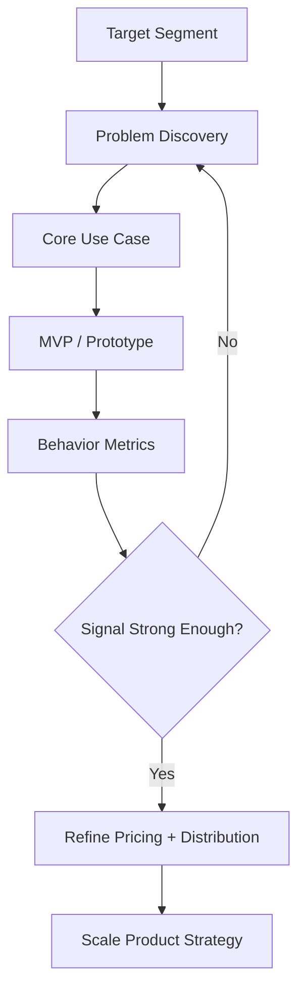

---
title: Product Strategy for Pre-PMF Startups
repo: founder-operating-system
primary_keyword: Product Strategy
secondary_keywords:
- Startup
- Growth Strategy
- Founder
slug: product-strategy-for-pre-pmf-startups
word_count_target: 1200
commit_type: 'docs(founder):'---

# Product Strategy for Pre-PMF Startups

## Introduction

For a pre-PMF Startup, Product Strategy is not about building the biggest roadmap or adding the most features. It is about finding a repeatable path to a problem that users care about enough to adopt, pay for, and recommend. Founders often confuse activity with progress: shipping faster, hiring more engineers, or expanding into adjacent use cases before the core value proposition is proven. That usually creates noise, not traction.

A strong Product Strategy helps a Founder answer three questions with evidence: Who is the product for? What painful problem are we solving? Why will users choose us now? Until those answers are clear, product decisions should be optimized for learning, not scale.

## Problem Statement

Pre-PMF startups face a common trap: they have a vision, some early users, and a backlog full of ideas, but no reliable signal that the product solves a must-have problem. Without Product Strategy, teams tend to drift into one of four failure modes:

1. **Feature sprawl** — building too many capabilities for too many segments.
2. **Vanity metrics** — tracking signups or page views instead of retention and activation.
3. **Premature optimization** — investing in scaling infrastructure before usage is stable.
4. **Misaligned teams** — product, engineering, and go-to-market teams each define success differently.

The underlying issue is not lack of effort. It is lack of focus. A pre-PMF Startup needs a disciplined way to decide what to build, what to ignore, and what evidence counts as progress.

## Solution

The most effective Product Strategy for pre-PMF startups is a problem-first, evidence-driven system. It should be built around four principles:

- **Narrow the customer segment**
- **Define the core job-to-be-done**
- **Measure behavior, not opinions**
- **Iterate on one high-value use case at a time**

Start with a clear segment. Instead of “small businesses” or “teams,” define a cohort with a shared pain, context, and urgency. For example: “B2B SaaS founders with 5–20 employees who need to reduce churn in onboarding.” The narrower the segment, the easier it is to validate messaging, pricing, and product value.

Next, define the job-to-be-done. What outcome are users trying to achieve? What forces are keeping them stuck with current alternatives? This becomes the anchor for roadmap decisions. If a feature does not help complete the job faster, more reliably, or with less effort, it is likely out of scope.

Then, use behavior-based metrics to validate the strategy:
- Activation rate
- Time to first value
- 7-day and 30-day retention
- Repeat usage frequency
- Conversion to paid
- Qualitative evidence of urgency, such as users pulling the team into their workflow

Finally, align the team around one core use case. A pre-PMF Startup should resist the temptation to serve every persona. Winning one workflow creates a base for expansion later.

## Architecture or Framework

A practical Product Strategy framework for pre-PMF startups can be organized into four layers: segment, problem, solution, and proof.

### 1. Target Segment
Define the smallest viable market where the pain is intense and frequent. Use filters such as:
- Industry
- Company size
- Role
- Trigger event
- Current workaround

### 2. Problem Discovery
Interview 10–20 users in the segment. Focus on:
- What they tried before
- What broke in the current workflow
- Why they switched or abandoned alternatives
- What success looks like in their words

Avoid asking, “Would you use this?” That produces polite, unreliable answers.

### 3. Core Use Case
Translate interviews into one primary workflow. Example: “Automatically identify and follow up with trial users who stall before activation.” This becomes the product’s center of gravity.

### 4. MVP / Prototype
Build the smallest version that tests the core use case. Depending on the problem, this may be:
- A clickable prototype
- A concierge workflow
- A no-code automation
- A thin software layer over manual operations

The goal is not completeness; it is proof.

### 5. Behavior Metrics
Instrument the product to measure whether users complete the core job. If the workflow is onboarding, measure:
- % who reach first value within 10 minutes
- % who return within 7 days
- % who complete the workflow twice

If the workflow is revenue-related, measure:
- Demo-to-trial conversion
- Trial-to-paid conversion
- Expansion usage by account

### 6. Decision Gate
Set a clear threshold for continuing, changing, or stopping. For example:
- Continue if 40%+ of activated users return weekly
- Pivot the use case if activation is high but retention is weak
- Stop if interviews show the pain is occasional, not urgent

This framework keeps Product Strategy grounded in evidence rather than intuition alone.

## Benefits

A disciplined Product Strategy creates several advantages for a Startup:

- **Faster learning cycles**: The team can test fewer assumptions per release and get clearer signals.
- **Better prioritization**: Roadmap debates become easier because every request is judged against the core use case.
- **Stronger positioning**: Clear segment focus improves messaging, sales conversations, and product-market fit discovery.
- **Higher retention potential**: Products built around urgent problems are more likely to become habitual.
- **More efficient fundraising**: Investors respond better to evidence of repeatable demand than to broad ambition without traction.

For the Founder, this reduces strategic ambiguity. Instead of asking, “What should we build next?” the question becomes, “What evidence do we need next?”

## Challenges

Pre-PMF Product Strategy is difficult because the data is incomplete and the market often changes as you learn. Common challenges include:

### Confusing feedback with demand
Users may praise the product but not use it. Positive interviews are not enough. Look for actions: repeated usage, referrals, willingness to pay, and urgency in follow-up.

### Overgeneralizing from a few customers
Early customers are not the market. A solution that works for one segment may fail in another, even if the problem sounds similar. Be careful about expanding before the signal is stable.

### Building for edge cases
Founders often overreact to one enterprise request or one loud customer. This can distort the roadmap and pull the team away from the core workflow.

### Measuring the wrong thing
Signups, downloads, and meetings booked are weak indicators if they do not correlate with retention or revenue. A Product Strategy should be evaluated using metrics tied to user value.

### Misalignment between product and distribution
A good product with poor distribution may still stall. If users need education, trust, or workflow change to adopt the product, the Growth Strategy must be designed alongside the product itself.

## Future Opportunities

Once a pre-PMF Startup begins to see consistent signal, Product Strategy can expand in controlled ways.

First, the team can explore adjacent use cases within the same segment. If the initial product solves onboarding, the next opportunity may be activation analytics or lifecycle messaging. The key is to expand from a proven workflow, not from a speculative roadmap.

Second, the startup can formalize pricing experiments. Early pricing should test willingness to pay and packaging, not just maximize revenue. Usage-based, seat-based, and outcome-based models each reveal different information about value perception.

Third, the company can build a stronger data layer. As usage grows, product telemetry, cohort analysis, and funnel analysis become essential. This helps the Founder separate anecdotal feedback from actual behavior patterns.

Fourth, the team can connect Product Strategy with distribution. The best products often encode a growth loop: collaboration, sharing, invited teammates, or workflow dependency. That creates a path from product value to organic adoption.

Finally, once the startup has repeatable retention and conversion, the strategy can shift from discovery to scaling. At that point, the roadmap can support more segments, deeper integrations, and operational efficiency without losing the original signal.

## Conclusion

For pre-PMF startups, Product Strategy is a discipline of focus, evidence, and restraint. The goal is not to build broadly; it is to prove that one specific problem matters enough for a specific segment to adopt the product repeatedly. A Founder who treats Product Strategy as a learning system will make better decisions about product, pricing, and distribution.

The best early strategy is simple: choose a narrow segment, solve one urgent problem, measure real behavior, and iterate until the signal is strong enough to scale. That is how a Startup moves from guesswork to traction.

## Related Reading

- (pending)