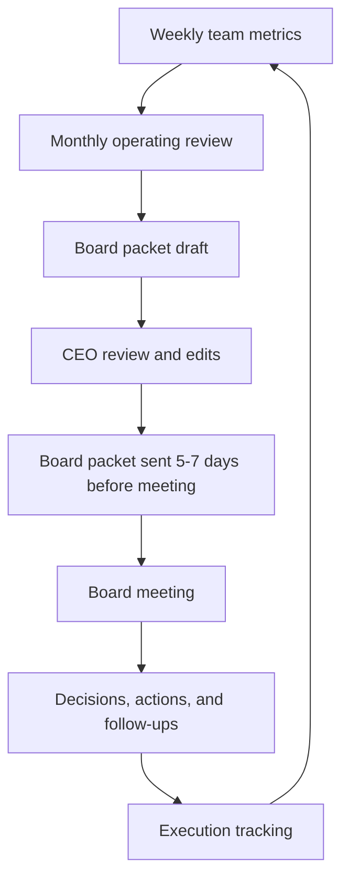

---
title: Board Meeting Operating Cadence
repo: founder-operating-system
primary_keyword: Leadership
secondary_keywords:
- CEO
- Business Operations
- Founder
slug: board-meeting-operating-cadence
word_count_target: 1200
commit_type: 'docs(founder):'---

# Board Meeting Operating Cadence for Startup Leadership

## Introduction

Strong **Leadership** is visible in how a startup runs its board meetings, not just in how it raises capital or sets strategy. A disciplined board meeting operating cadence helps a company move faster, reduce surprises, and keep the board focused on the few decisions that matter. For a **CEO**, this cadence is one of the most important parts of company **Business Operations** because it shapes trust, accountability, and decision quality.

For founders, the board is not only a governance body. It is also a strategic system for alignment. When managed well, board meetings create a repeatable rhythm for reviewing performance, surfacing risks, and making decisions with the right level of context. When managed poorly, they become reactive, overly long, and disconnected from execution.

This article outlines a practical board meeting operating cadence for founders and executives who want a board process that supports scale without adding unnecessary overhead.

## Problem Statement

Many startups treat board meetings as isolated events rather than part of a continuous operating system. The result is predictable:

- Updates are assembled at the last minute.
- Metrics are inconsistent across meetings.
- The board focuses on historical reporting instead of forward-looking decisions.
- The **Founder** and **CEO** spend too much time preparing slides and too little time driving the business.
- Critical issues are not surfaced early enough for useful feedback.

A weak cadence also creates hidden costs. If the board only hears about churn, cash burn, hiring gaps, or product delays once per quarter, then leadership loses the chance to course-correct sooner. In practice, the board should be a place where the company validates assumptions, tests strategic choices, and pressure-tests execution.

The core problem is not usually the board itself. It is the absence of a consistent operating model around it. Without a defined schedule, owners, and decision framework, meetings drift into status updates rather than decision-making sessions.

## Solution

The solution is to treat board meetings as part of a recurring management cadence with clear inputs, outputs, and responsibilities.

A strong board meeting operating cadence includes:

1. **Monthly internal operating reviews**
   - Run by the executive team.
   - Focus on metrics, risks, and cross-functional execution.
   - Produce the raw material for board reporting.

2. **Pre-board preparation**
   - Send board materials 5 to 7 days in advance.
   - Include a concise narrative, KPI trends, key decisions needed, and explicit asks.
   - Avoid overloading the deck with operational detail.

3. **Quarterly board meetings**
   - Use the meeting for decisions, strategic discussion, and risk review.
   - Keep reporting concise and consistent.
   - Reserve time for the topics that require board input.

4. **Post-board follow-up**
   - Document decisions, open questions, and owners within 24 hours.
   - Track action items in the same system used by the leadership team.

This approach keeps the board connected to the company’s operating rhythm rather than placing all the burden on one meeting.

The most effective board meeting operating cadence usually answers four questions:

- What happened since the last meeting?
- What changed in the business?
- What decisions are needed now?
- What risks could affect the next 90 days?

If the board materials cannot answer these questions clearly, the cadence is too weak.

## Architecture or Framework

A practical framework is to run the board process as a three-layer system: operating review, board packet, and board meeting.

### 1. Weekly team metrics

The leadership team should track a consistent set of metrics every week. These may include:

- Revenue and pipeline
- Burn and runway
- Hiring progress
- Product delivery milestones
- Customer retention and churn
- Support or incident trends

The goal is not to create a large dashboard. The goal is to ensure the same metrics are reviewed regularly so changes are visible early.

### 2. Monthly operating review

This meeting is internal to the leadership team and should be used to identify issues before the board sees them. The **Business Operations** owner or chief of staff can help maintain the agenda, but the **CEO** should own the narrative.

Recommended monthly review format:

- 10 minutes: KPI review
- 15 minutes: functional updates
- 20 minutes: top risks and blockers
- 15 minutes: decisions and escalations

The output should be a short list of board-relevant themes, not a long transcript.

### 3. Board packet structure

A board packet should usually include:

- Executive summary
- KPI dashboard with trends
- Wins and misses since last meeting
- Strategic priorities
- Hiring and org updates
- Financial status and runway
- Key decisions required
- Specific board asks

The packet should be readable in under 20 minutes. If it takes an hour to understand, the board meeting will likely become too tactical.

### 4. Board meeting design

A standard board meeting agenda for startups can be:

- 10 minutes: executive summary
- 20 minutes: KPI and financial review
- 20 minutes: strategic priorities
- 20 minutes: product, customer, or market discussion
- 20 minutes: decisions and board feedback
- 10 minutes: executive session

This structure keeps the meeting balanced between reporting and decision-making. The **Founder** should avoid spending the full meeting defending every operational detail. Instead, use the meeting to clarify trade-offs and get alignment.

### 5. Decision log and follow-through

Every board meeting should produce a decision log with:

- Decision made
- Owner
- Due date
- Success metric
- Risks or dependencies

This creates accountability and helps the next meeting start with action items rather than rehashing old discussions.

## Benefits

A disciplined board meeting operating cadence produces measurable benefits for startups.

### Better strategic focus

When the board receives consistent, concise information, it can focus on the few strategic issues that matter most. That improves the quality of discussion and reduces time spent on low-value updates.

### Faster issue detection

Regular operating reviews and clean metrics make it easier to spot negative trends early. That can improve runway management, reduce hiring mistakes, and prevent avoidable execution drift.

### Stronger CEO credibility

A **CEO** who runs a clear board cadence signals control, judgment, and transparency. Board members are more likely to trust leadership when they see a repeatable process and honest reporting.

### Improved founder alignment

For a **Founder**, the board cadence becomes a tool for aligning investors, executives, and operators around the same priorities. This reduces mixed messages and avoids last-minute surprises.

### More effective Business Operations

A strong board process reinforces discipline across the company. It forces the organization to define metrics, assign owners, and review progress consistently, which strengthens overall **Business Operations**.

## Challenges

Even with a good framework, execution can be difficult.

### Over-preparation and slide sprawl

Founders often overbuild board decks to anticipate every question. That creates bloated materials and distracts from the main decisions. The fix is to separate reporting from discussion and keep the packet concise.

### Inconsistent metrics

If each board meeting uses different definitions for revenue, pipeline, or churn, the conversation becomes confusing. Establish metric ownership early and document definitions in one source of truth.

### Too much tactical detail

Boards can drift into operational problem-solving that should happen inside the management team. The **CEO** should redirect discussion toward decisions, trade-offs, and risks rather than day-to-day execution unless the issue is material.

### Lack of pre-alignment

If board members see critical topics for the first time during the meeting, discussion becomes reactive. Pre-briefing the chair or key investors on sensitive issues can improve meeting quality and reduce friction.

### Weak follow-through

A meeting without action tracking creates the illusion of progress. Assign every action item an owner and due date, and review open items at the start of the next meeting.

## Future Opportunities

As companies scale, the board meeting operating cadence can become more sophisticated.

### Better data automation

Finance and operations teams can automate KPI reporting directly from systems like the CRM, billing platform, and accounting stack. This reduces manual prep time and improves accuracy.

### Board portals and collaboration tools

Modern board portals can centralize decks, minutes, decisions, and action logs. This makes it easier for distributed teams and investors to stay aligned between meetings.

### More scenario-based planning

Instead of only reporting historical performance, startups can use board meetings to review scenarios such as:

- What happens if growth slows by 20%?
- What if hiring takes longer than planned?
- What if churn rises in one segment?

This makes board discussions more useful for resilience planning.

### Stronger governance without bureaucracy

As startups mature, they need better governance without turning the board into a compliance-heavy process. A well-designed cadence allows the company to maintain speed while improving decision quality and accountability.

## Conclusion

A strong board meeting operating cadence is a leadership system, not an administrative task. For founders and executives, it creates a repeatable way to share context, surface risks, and make decisions with the board at the right time.

The best cadence is simple: review metrics regularly, prepare concise materials, use board meetings for strategic decisions, and track follow-through carefully. When this rhythm is consistent, the board becomes a force multiplier for the company rather than a source of interruption.

For startups that want sharper execution and better alignment, the board meeting process should be treated as part of core **Leadership** practice. It is one of the clearest signals that the company is building a scalable operating model.

## Related Reading

- (pending)